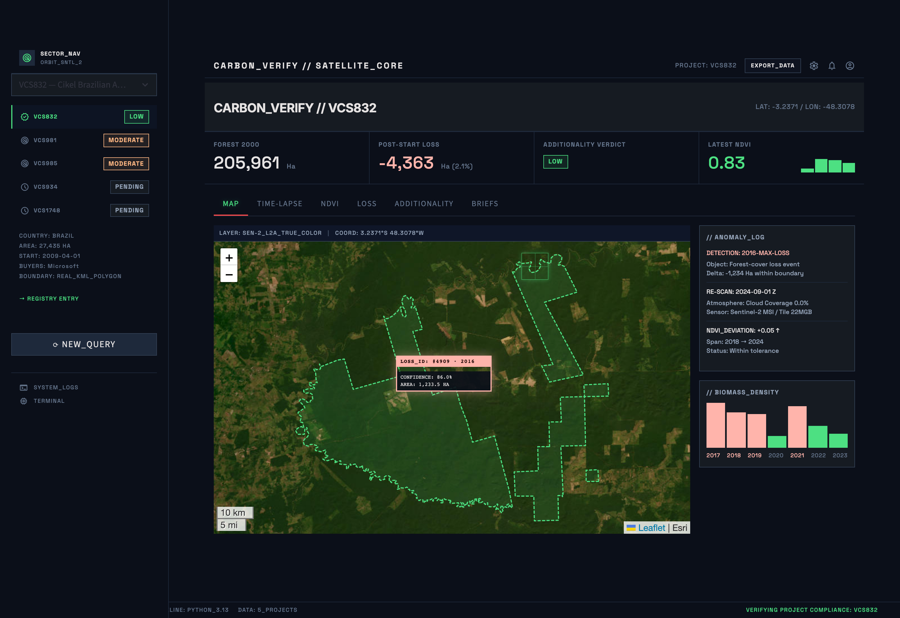
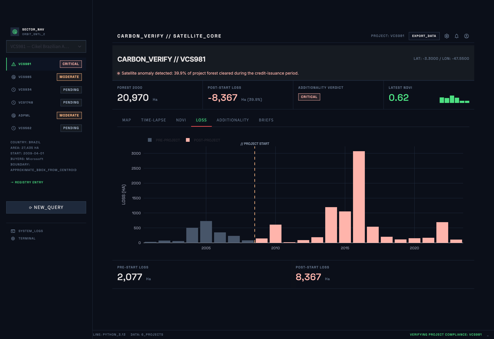
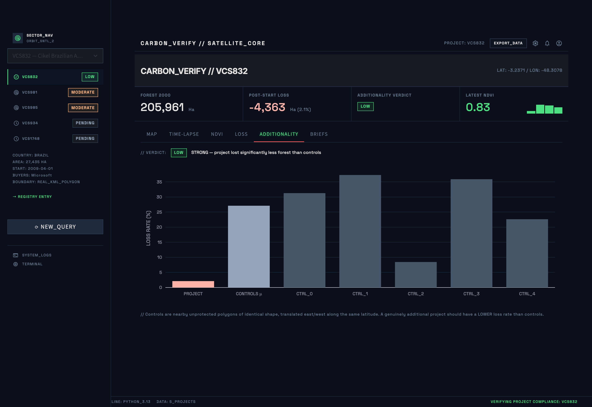
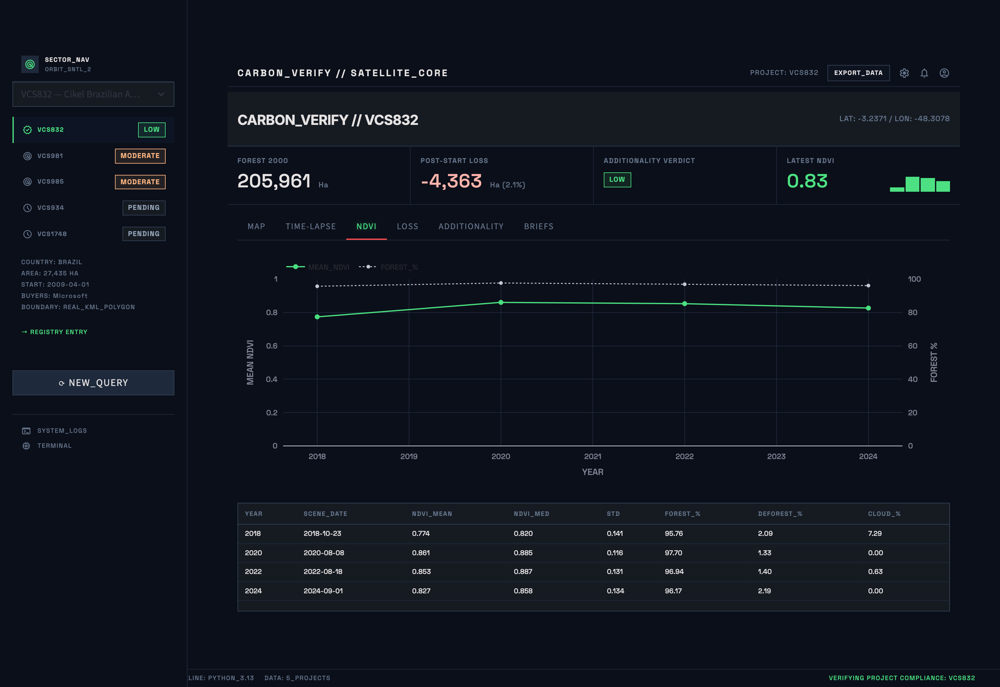
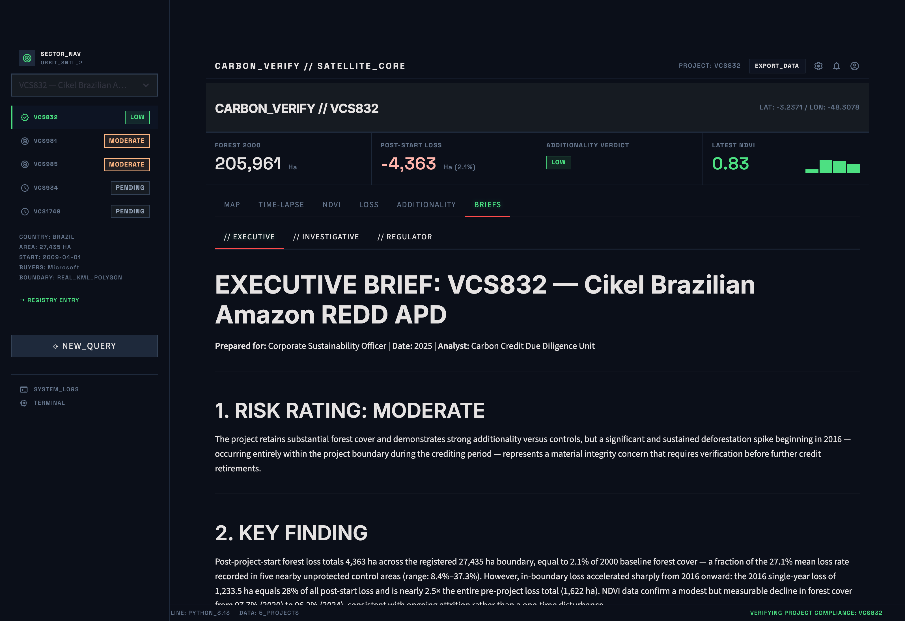
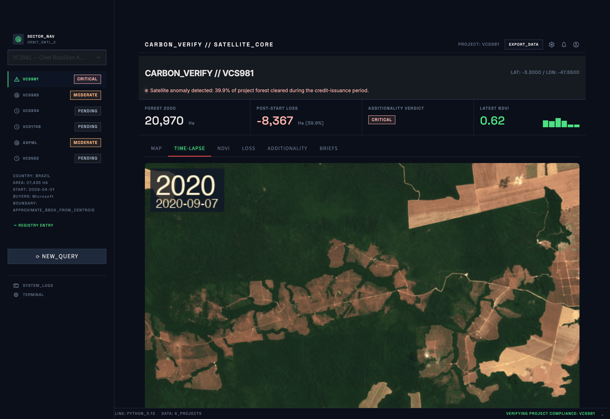
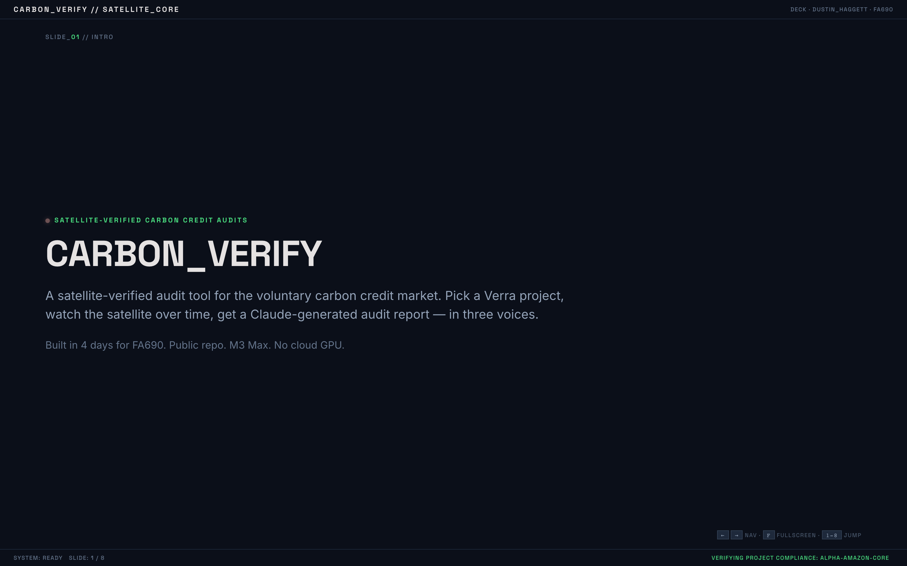

# CarbonVerifier

**A satellite-verified audit tool for the voluntary carbon credit market.**

In January 2023, *The Guardian* and *Die Zeit* exposed that 90%+ of Verra's Amazon rainforest carbon credits were "phantom" — projects claiming forest preservation while satellites showed ongoing deforestation. Microsoft, Disney, Shell, BHP, and Salesforce all bought them. The voluntary carbon market is **$2 billion a year**. There has been no good way for buyers to know if what they bought is real.

This repo gives them a way: pick a Verra project, watch the satellite data over time, get a Claude-generated audit report.



## What it does

For any registered REDD+ carbon project, the pipeline:

1. **Loads the project boundary** — real polygon (KML / GeoJSON) when available, bbox approximation otherwise
2. **Pulls Sentinel-2 imagery** for selected years from the [Element 84 STAC API](https://earth-search.aws.element84.com/v1) (no auth)
3. **Pulls Hansen Global Forest Change** v1.11 tiles directly from Google Cloud Storage (no Earth Engine auth)
4. **Computes NDVI** (vegetation health) inside the project geometry, year by year, with SCL cloud-masking
5. **Computes Hansen forest-loss** inside the geometry, broken down by year, before vs. after the project start date
6. **Runs an additionality test** — generates 5 control polygons by translating the project geometry east/west along the same latitude, computes the same loss metrics for each, and compares
7. **Generates three Claude-authored audit reports** from the same evidence package, in three voices:
   - **Executive Brief** for a corporate sustainability buyer (1 page, business-focused, with risk rating + recommended action)
   - **Investigative Article** in journalism style (~600 words, narrative)
   - **Regulator Compliance Brief** flagging specific Verra Standard violations (3.4 / 3.5 / 3.7 / 3.14 / AFOLU 3.1.6)
8. **Renders an animated GIF time-lapse** of the project area, year by year, with date stamps
9. **Serves it all** through a Streamlit dashboard styled as an "orbital forensic interface" (Bloomberg Terminal × NASA control room)

## Headline findings (real, not placeholder)

Three projects have run end-to-end through the pipeline:

| Project | Boundary | Forest@2000 | Post-start loss | Loss rate | Additionality verdict |
|---|---|---|---|---|---|
| **Cikel (VCS-981)** — Microsoft buyer | bbox | 20,970 ha | 8,367 ha | **39.9%** | **NEGATIVE −17.9 pp** |
| **ADPML / Pacajai** — Verra-suspended | real KML, 5 polygons | 123,276 ha | 7,963 ha | 6.46% | WEAK +3.5 pp |
| **Cordillera Azul (VCS-985)** — Shell, TotalEnergies buyers | real WDPA polygon | 1,360,318 ha | 8,345 ha | 0.61% | WEAK +3.2 pp |

Each tells a different story:

- **Cikel** — satellite-visible failure. Forest cleared at nearly double the rate of nearby unprotected land, *during* the credit-issuance period. Negative additionality. The textbook "phantom credits" case.
- **ADPML** — forest is mostly intact (project did marginally better than controls), but Verra suspended the project for **land-grabbing allegations** invisible to satellites. Demonstrates the limits of remote sensing as accountability infrastructure.
- **Cordillera Azul** — only 0.6% loss inside the registered park (matches the published 1.35M ha exactly via WDPA polygon). But the controls also lost very little. The CarbonPlan critique applies: *the park was already a national park before the carbon project existed; satellite data cannot disentangle pre-existing legal protection from the REDD intervention*.

## Screenshots

| MAP | LOSS | ADDITIONALITY |
|---|---|---|
|  |  |  |
| **NDVI** | **BRIEFS** | **TIME-LAPSE** |
|  |  |  |

## Demo deck

Eight-slide pitch deck rendered in the same forensic-terminal aesthetic as the app — open [`docs/deck/index.html`](docs/deck/index.html) in any browser and present full-screen (`F`).

[](docs/deck/index.html)

A 90-second walkthrough script with timing cues, click cheat-sheet, and recovery plan if the live app lags lives at [`docs/DEMO_SCRIPT.md`](docs/DEMO_SCRIPT.md).

## Quickstart

Requirements: Python 3.13, [`uv`](https://docs.astral.sh/uv/), an Anthropic API key.

```bash
git clone https://github.com/<you>/CarbonVerifier
cd CarbonVerifier
uv sync                                 # creates .venv, installs deps
cp .env.example .env                    # then put your ANTHROPIC_API_KEY in .env
```

### Pull data + run the analysis for a demo project

```bash
# Day 1 — boundary, Sentinel-2, Hansen forest-loss
uv run python scripts/fetch_project.py VCS981 --years 2018,2020,2022,2024

# Day 2 — NDVI series, additionality test, Claude reports, time-lapse GIF
uv run python scripts/analyze_project.py VCS981
```

These two scripts are **idempotent**: re-running skips downloads that are already cached.

### Launch the dashboard

```bash
uv run streamlit run app.py
```

## Project structure

```
CarbonVerifier/
├── README.md
├── pyproject.toml                uv-managed deps; Python 3.13
├── .env.example
├── .gitignore                    excludes raw rasters (multi-GB) + .env
│
├── app.py                        Streamlit dashboard ("Orbital Forensic Interface")
├── assets/
│   └── forensic.css              design tokens + Streamlit chrome overrides
│
├── src/cv/                       core pipeline modules
│   ├── paths.py                  filesystem layout
│   ├── projects.py               Project dataclass + KML/GeoJSON loader
│   ├── geometry.py               KML & GeoJSON → shapely MultiPolygon
│   ├── sentinel.py               Sentinel-2 STAC client (Element 84)
│   ├── hansen.py                 Hansen GFC tile downloader
│   ├── forest_loss.py            polygon-clipped loss summary (rasterio.mask)
│   ├── ndvi.py                   NDVI + SCL cloud-masking, polygon-clipped
│   ├── additionality.py          control-polygon translation + comparison
│   ├── audit_reports.py          three Claude prompts + evidence-block builder
│   ├── timelapse.py              animated GIF builder (PIL + rasterio)
│   ├── pdf.py                    Markdown → ReportLab PDF
│   └── ui.py                     HTML helpers for the forensic Streamlit shell
│
├── scripts/
│   ├── fetch_project.py          Day 1 — boundary + Sentinel-2 + Hansen + Folium map
│   ├── analyze_project.py        Day 2 — NDVI + additionality + Claude + GIF
│   ├── screenshot_app.py         Playwright screenshot of the running app
│   └── screenshot_tabs.py        screenshot every tab
│
├── data/
│   ├── projects.json             6 demo-project fixtures (metadata + boundary refs)
│   ├── raw/
│   │   ├── verra/                project KML / GeoJSON (committed; small)
│   │   ├── sentinel2/            visual + red + nir + scl bands (gitignored; ~8 GB)
│   │   └── hansen/               UMD GFC tiles (gitignored; ~1.5 GB)
│   ├── processed/                per-project dataset manifests (committed)
│   └── cache/                    NDVI / additionality JSONs, Claude reports (.md),
│                                  time-lapse GIFs, Folium HTML maps
│
├── design/                       Stitch-generated forensic-terminal mockup
│   ├── DESIGN.md                 design system (palette, typography, components)
│   ├── code.html                 reference HTML mockup
│   └── screen.png                mockup screenshot
│
└── docs/screenshots/             PNGs used in this README
```

## Data sources

| Source | What it gives | Access |
|---|---|---|
| [Element 84 STAC](https://earth-search.aws.element84.com/v1) | Sentinel-2 L2A scenes (red, NIR, SCL, visual TCI) | Public, no auth |
| [Hansen Global Forest Change v1.11](https://glad.umd.edu/dataset/global-2010-tree-cover-30-m) | Annual deforestation 2001–2023 | Direct GeoTIFF tiles on Google Cloud Storage, no auth |
| [WDPA / ProtectedPlanet](https://www.protectedplanet.net) | National-park / protected-area boundaries | UNEP-WCMC ArcGIS REST endpoint, no auth |
| Verra registry (verra.org) | Project IDs, names, hectares | HTML pages — no public bulk-CSV API; project polygons must be obtained manually from each project's PDD or external mirrors |

## Pipeline knobs

The 6 demo projects are defined in [`data/projects.json`](data/projects.json). Each entry supports:

- `bbox` — `[minx, miny, maxx, maxy]` in WGS84 (used when no real polygon)
- `kml_path` — path to a `.kml` or `.geojson` file with the registered polygon
- `preferred_mgrs_tile` — pin Sentinel-2 scene selection to a single MGRS tile for time-series consistency (e.g., `"22MHB"` for Cikel)
- `sentinel_require_contains_bbox` — set `false` for projects whose bbox is too large for any single Sentinel-2 footprint

Sentinel-2 scene picker fallback chain: dry-window + preferred-tile + footprint-contains-bbox → dry-window + any tile → full-year + preferred-tile → full-year + any tile + intersect-area-DESC. Picks the maximum-coverage scene at the lowest cloud cover.

## Architecture decisions worth noting

- **Polygon clipping** uses `rasterio.mask.mask` with `crop=True` — single-pass read of just the geometry's bounding-box window, then null pixels outside the polygon. Bit-identical to bbox-window reads when the geometry is itself a rectangle.
- **Control areas for additionality** are *translated copies of the project polygon*, not bbox shifts — same area, same shape, same latitude band, just offset 1.5×–2.5× the bbox-width east/west.
- **Claude evidence block** is constructed from raw numbers only. The prompt explicitly instructs Claude to name only buyers in the "Known credit buyers" line and to never substitute training-data knowledge for missing facts.
- **Streamlit caching** (`@st.cache_data`) wraps every disk read; re-renders are sub-second.
- **GIF rendering** reads each year's pre-cached `visual.tif`, reprojects the project bbox into the scene's UTM CRS, percentile-stretches if the dtype isn't already uint8, stamps year + scene-date, and assembles via PIL.

## Caveats / known gaps

- **Cikel (VCS-981) and 4 other projects** still use bbox approximations. Verra hosts boundary KMLs in PDD documents but not via API; obtaining them requires manual download per project.
- **Hansen v1.11 stops at 2023.** For 2024+ deforestation we lean on Sentinel-2 NDVI deltas.
- **Additionality controls are translated bboxes**, not biome-matched parcels. For projects where east/west translation lands in a different biome (e.g., the Andes for VCS-985), some controls return zero forest. Workable for a demo, not a regulatory tool.
- **Sentinel-2 scene picker** does not yet mosaic multiple scenes per year. Projects whose polygon spans multiple MGRS tiles get partial coverage from a single scene.
- **Claude reports** can hallucinate buyer attributions if the user's metadata is wrong. The strict-factual-constraints prompt suppresses most of this; verify any specific corporate claim before publishing.

## Built with

- Python 3.13, [`uv`](https://docs.astral.sh/uv/), [Streamlit](https://streamlit.io)
- [`anthropic`](https://github.com/anthropics/anthropic-sdk-python) — Claude Sonnet 4.6 for the audit reports
- [`pystac-client`](https://github.com/stac-utils/pystac-client) — STAC API
- [`rasterio`](https://github.com/rasterio/rasterio) + [`shapely`](https://github.com/shapely/shapely) — geospatial ops
- [`folium`](https://github.com/python-visualization/folium), [`plotly`](https://github.com/plotly/plotly.py), [`reportlab`](https://www.reportlab.com), [Pillow](https://github.com/python-pillow/Pillow)
- [Google Stitch](https://stitch.withgoogle.com) — forensic-terminal mockup design

## Origin

Class project for FA690 — *Creativity Olympics with Generative AI*. The bar is "leverages Generative AI in a clear and central way." Built in 4 days on an Apple M3 Max, no cloud GPU.

## License

MIT — see [LICENSE](LICENSE).

---

*If you're a corporate sustainability team, journalist, or regulator and want to use this on a production basis, the pipeline is forkable and the data sources are all public. Real polygon boundaries and human review of Claude's reports are required for anything beyond exploratory work.*
